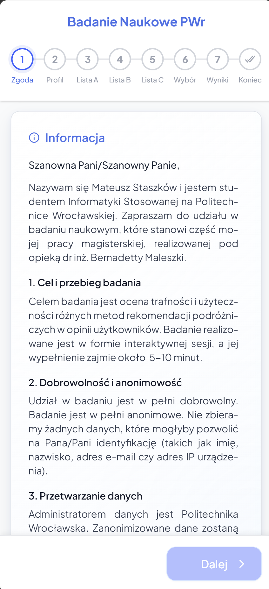
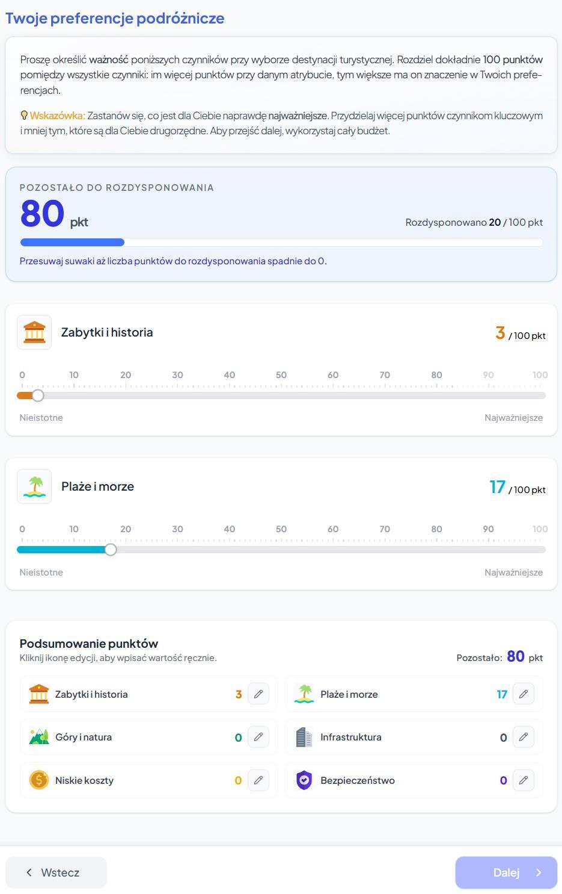
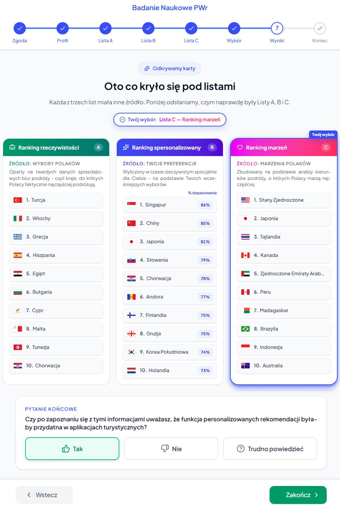
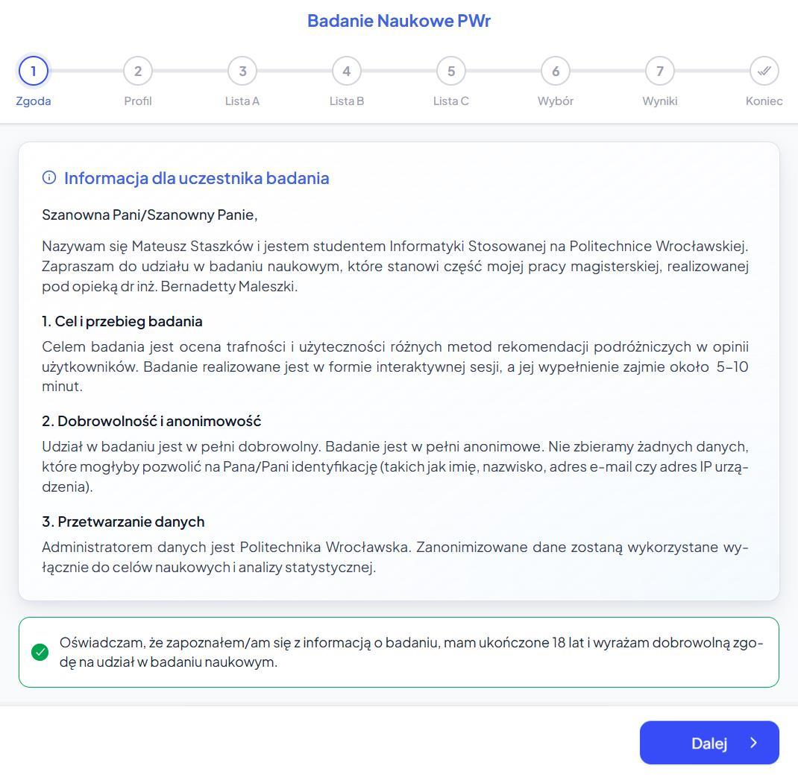
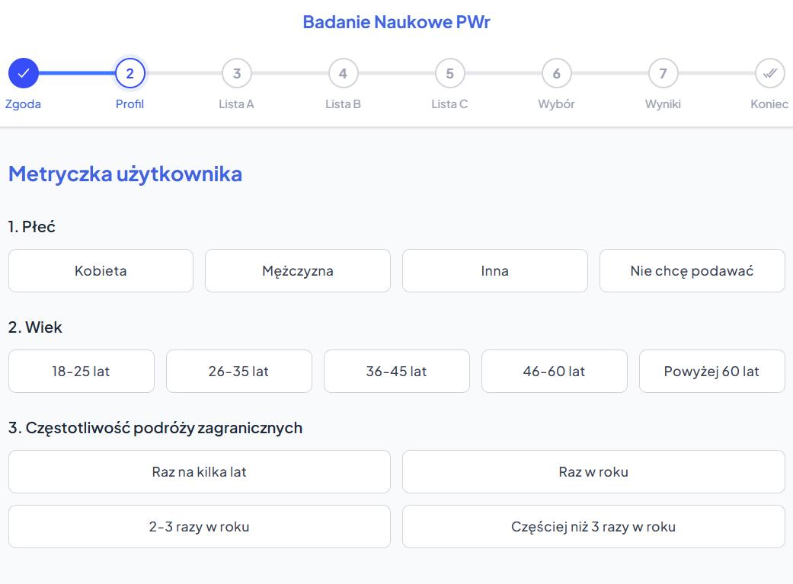
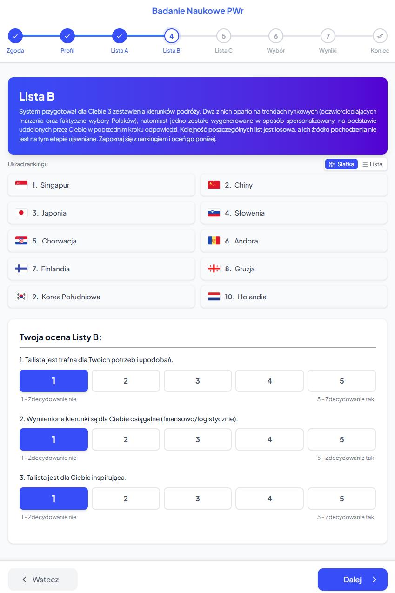
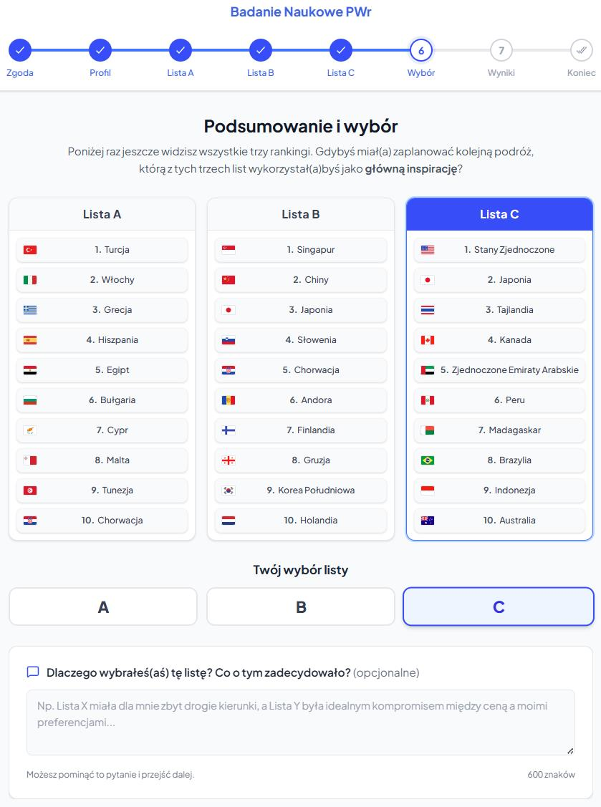

<div align="center">
  <h1>🌍 Tourism Recommendation System 🌍 <br/> <sub>Interactive Research Platform</sub></h1>
</div>

<p align="center">
  
  
  
  
  
</p>

<div align="center">
  <h2>👉 <a href="https://ankieta.stvshy.com/">Live Demo</a> 👈 </h2> 
  <p></p><i>The live interactive survey interface is available only in <b>Polish</b>.</i></p>
</div>
<br>

> **Note on Live Demo:** The application is fully functional on the frontend. However, since the academic research phase has concluded, the backend database (Supabase Free Tier) is likely paused due to inactivity. You can still go through the entire interactive process, but your final results might not be saved to the database.

**Tourism Recommendation System** is a custom-built Single Page Application (SPA) designed to serve as an interactive research tool for my Master's Thesis: *"Comparative analysis of tourism ranking construction methods in the context of the discrepancy between tourists' aspirations and actual behaviors"* (Wrocław University of Science and Technology).

🚀 **Moving beyond static surveys!** Instead of traditional, boring questionnaire forms (like Google Forms), this application calculates personalized travel destinations in real-time, engaging users through gamification and smooth UX/UI.

---

## 🧠 Motivation & Research

The main problem addressed in this project is the **Intention-Behavior Gap** in tourism. People often dream of visiting exotic, distant countries (aspirations), but ultimately choose familiar, cheaper, and closer destinations (reality) due to financial and logistical constraints.

I built this application to test if an **algorithmic multi-criteria personalization** (using the **Weighted Sum Model - WSM**) can effectively fill this gap and recommend relatively cheap and desired destinations by the respondent, which he or she might not have considered in the context of travel due to the lack of sufficient knowledge about these countries. By forcing users into a blind test against static rankings (Dreams vs. Reality), the system successfully proved that the WSM algorithm offers the optimal compromise, achieving the highest relevance and inspiration scores among 506 respondents.

---

## 📸 Application Overview

### ✨ Featured Views


**Flawless UX/UI for better data quality.** To prevent survey fatigue and "straightlining" (where users lazily select the same answers), the app utilizes a highly responsive and animated interface.

* **Constant Sum Scale:** Users distribute exactly 100 points among 6 criteria, forcing them to prioritize their actual needs.
* **Real-time Client-Side Processing:** The WSM algorithm calculates the ranking of 60 countries in milliseconds.
* **Mobile-First Design:** Perfect typography (using Polish hyphenation algorithms) and smooth transitions.

<br clear="all"> <br>

<table width="100%">
  <tr>
    <th width="47%" align="center">Interactive Profiling (Constant Sum)</th>
    <th width="50%" align="center">Final Results (Unblinding)</th>
  </tr>
  <tr>
    <td align="center"></td>
    <td align="center"></td>
  </tr>
  <tr>
    <td align="center"><i>Users allocate a 100-point budget to define their travel priorities.</i></td>
    <td align="center"><i>Explainable AI approach: revealing the source of each generated ranking.</i></td>
  </tr>
</table>

<br>

## 📂 Full Interface Gallery (Research Scenario)

### 📝 1. Introduction & Consent
<details>
  <summary>&nbsp;&nbsp;<b>Click to expand</b></summary>
  <br>
  <p align="center">
    
    <br><i>Step 1: Legal information and GDPR consent.</i>
  </p>
</details>

### 🎚️ 2. Demographics & Preference Profiling
<details>
  <summary>&nbsp;&nbsp;<b>Click to expand</b></summary>
  <br>
  <p align="center">
    
    <br><i>Step 2 (Part 1): Gathering user demographic data</i>
  </p>
  <br>
  <p align="center">
    
    <br><i>Step 2 (Part 2): Distributing 100 points across 6 criteria (WSM weights)</i>
  </p>
</details>

### 🙈 3. Blind Test Evaluation
<details>
  <summary>&nbsp;&nbsp;<b>Click to expand</b></summary>
  <br>
  <p align="center">
    
    <br><i>Step 3, 4 & 5: Users evaluate 3 anonymous lists (A, B, C) using a 5-point Likert scale.</i>
  </p>
</details>

### ⚖️ 4. Forced Choice
<details>
  <summary>&nbsp;&nbsp;<b>Click to expand</b></summary>
  <br>
  <p align="center">
    
    <br><i>Step 6: Users must choose the single best list as their future travel inspiration.</i>
  </p>
</details>

### 🃏 5. The Reveal & Market Validation
<details>
  <summary>&nbsp;&nbsp;<b>Click to expand</b></summary>
  <br>
  <p align="center">
    
    <br><i>Step 5: The algorithms are revealed, and users judge the market usefulness of the feature.</i>
  </p>
</details>

<br>

## 📊 Data Engineering & The Excel Core (`.xlsx`)

The repository contains the original `.xlsx` files which act as the mathematical and analytical foundation of the system. In order for the WSM algorithm to work, a standardized decision matrix for 60 global destinations had to be engineered from scratch.

* **`ranking_rzeczywistosci.xlsx` (Reality Ranking):** Models actual travel behaviors. It aggregates hard sales data from major Polish travel agencies and airlines, representing the mass-market "Reality".
* **`ranking_aspiracji.xlsx` (Aspirations Ranking):** Models travel dreams. It utilizes the Borda Count rule to aggregate public opinion surveys and Google Trends data, creating a hierarchy of the most desired destinations among Poles.
* **`ranking_personalizowany.xlsx` (The WSM Engine):** The absolute core of the app. This file documents the raw data extraction, missing data imputation, and Min-Max linear normalization for 60 countries across 6 criteria:
  1. **Monuments & History:** UNESCO sites + global media reputation (U.S. News, TimeOut).
  2. **Beaches & Sea:** Coastal Appeal Index (water temperature & season length) + Beach Reputation Score.
  3. **Mountains & Nature:** Topographical data (max elevation, forest coverage) + UNESCO Natural sites.
  4. **Infrastructure:** Data extracted from the *WEF Travel & Tourism Development Index 2024*.
  5. **Low Costs:** Local cost of living (*Numbeo*) combined with average flight costs from Poland (scraped from *Skyscanner* across 3 different seasons).
  6. **Safety:** Institutional safety indices combined with street-level crime perception.

*The normalized matrix from this Excel file was exported to `src/data/personalizedRanking.json` to feed the React application.*

<br>

## 🛠️ Technology Stack

* **Frontend:** React 19, Vite, JavaScript (ES6+).
* **Styling:** Tailwind CSS 4 (Fully responsive, custom animations).
* **Backend / Database (BaaS):** Supabase (PostgreSQL) for asynchronous, anonymous data collection.
* **Hosting:** Vercel (App) + Cloudflare (DNS/SSL).
* **Typography:** `hypher` + `hyphenation.pl` for correct Polish word-breaking on small screens.
* **Data Analysis:** Python (Pandas) was used post-collection to analyze the `survey_results.csv` and generate cross-tabulations (`summary_results.txt`).

<br>

## 🚀 Run Locally

Want to test the app on your machine?

1. **Clone the repository:**
   ```bash
   git clone https://github.com/stvshy/ankieta-magisterska.git
   cd ankieta-magisterska
   ```

2. **Install dependencies:**
   ```bash
   npm install
   ```

3. **Configure Environment Variables (Optional):**
   If you want to save survey results to your own database, create a `.env` file in the root directory:
   ```env
   VITE_SUPABASE_URL=your_supabase_url
   VITE_SUPABASE_PUBLISHABLE_KEY=your_supabase_anon_key
   ```
   *(If not provided, the app will run perfectly in UI-only mode, bypassing the database insert).*

4. **Start the development server:**
   ```bash
   npm run dev
   ```
   Open your browser at `http://localhost:5173`.

<br>

## 🎓 Author & Academic Info

* **Author:** Mateusz Staszków
* **University:** Wrocław University of Science and Technology (Politechnika Wrocławska)
* **Faculty:** Faculty of Information and Communication Technology
* **Field of Study:** Applied Computer Science - Information Systems Design

 <br>

## 📄 Full Thesis Document

The complete text of my Master's Thesis, including detailed methodology, literature review, and comprehensive results (entirely in Polish), is available in this repository in the file: **`Praca magisterska - Mateusz Staszków.pdf`**.

<br>

## ⚖️ License & Copyright

**© 2026 Mateusz Staszków. All rights reserved.**

This project, including all source code, UI/UX design, algorithms, and data files (`.xlsx`, `.json`, `.csv`, `.txt`), is my exclusive intellectual property. 

* **No Commercial Use:** You may not use, reproduce, distribute, or modify any part of this repository for commercial purposes without my explicit written consent.
* **Academic/Learning Use:** You may view and study the code strictly for personal or academic learning purposes.
* **Commercial Licensing:** If you are interested in utilizing this recommendation system, its algorithms, or the engineered datasets for commercial or business purposes, please contact me directly to negotiate a license and appropriate compensation.

The raw, anonymized dataset collected during the live phase of the app is available in `survey_results.csv`, and the generated analytical summaries are provided in `.txt` files.
